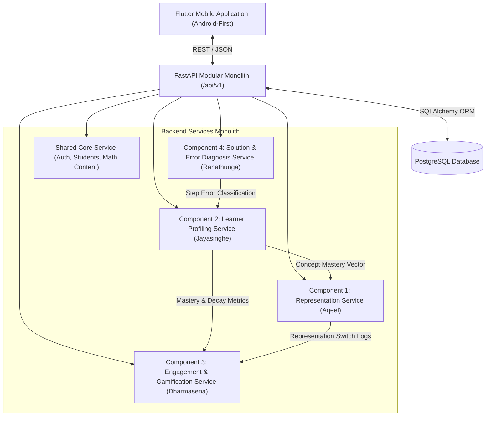

# Component Dependency Map — J26-IT-453 Adaptive Learning Platform

This document maps the architectural dependencies, service interfaces, and data flows among the four research components and the shared core platform.

---

## 1. System Architecture Overview



---

## 2. Component Service Interfaces & Interactions

| Source Component | Target Component | Data / Interface Exchanged | Purpose |
| :--- | :--- | :--- | :--- |
| **Component 4** (Error Diagnosis) | **Component 2** (Learner Profiling) | `record_error_event(student_id, concept_id, error_type, step_index)` | Feeds specific error category evidence into knowledge tracing model to adjust slip/misconception probabilities. |
| **Component 2** (Learner Profiling) | **Component 1** (Representation) | `get_learner_mastery(student_id, concept_id)` | Provides real-time concept mastery probability $P(K_c)$ to determine representation complexity/format. |
| **Component 2** (Learner Profiling) | **Component 3** (Engagement) | `get_learner_progress_summary(student_id)` | Supplies mastery trends, forgetting metrics, and active concept counts for progress dashboard and streaks. |
| **Component 1** (Representation) | **Component 3** (Engagement) | `get_representation_switch_event(student_id)` | Notifies engagement engine of learner struggle to trigger encouraging adaptive feedback. |
| **Shared Core** (Math Content) | **All Components** | `get_concept(concept_id)`, `get_question(question_id)` | Provides baseline curriculum structures, prerequisite nodes, and canonical questions. |

---

## 3. Shared Entity Dependency Matrix

```
Entity                     Owner Component     Producer Component     Consumer Components
-----------------------------------------------------------------------------------------
students                   Shared Core         Auth / Admin           All Components
concepts                   Shared Core         Curriculum Admin       C1, C2, C4
questions                  Shared Core         Curriculum Admin       C1, C2, C3, C4
attempts                   Shared Core         Mobile App             C2, C3, C4
learner_profiles           Component 2         Component 2            C1, C3, Shared Core
representations            Component 1         Component 1            Mobile App
representation_outcomes    Component 1         Mobile App / C1        C1, C2, C3
error_diagnosis            Component 4         Component 4            C2, C3, Mobile App
game_sessions              Component 3         Component 3            Component 3, Mobile App
student_engagement         Component 3         Component 3            Component 3, Shared Core
```

---

## 4. Architectural Rules for Component Independence
1. **Decoupled Business Logic**: Component services MUST NOT directly read or write private tables owned by another component. All cross-component communication must pass through service interfaces or shared API schema contracts.
2. **Deterministic Stubs for Testing**: Each component service interface MUST expose a development stub implementation (`*_stub.py`) returning valid deterministic data during foundation development.
3. **Stateless API Endpoints**: All `/api/v1/` routes must be stateless, receiving student context via JWT or authenticated request payload.
