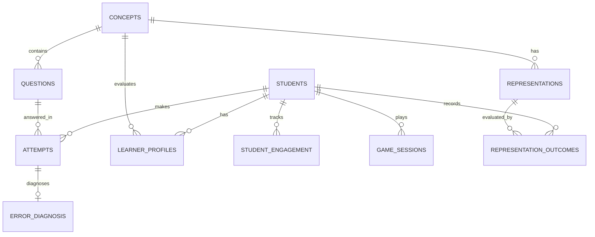

# Shared Database Design Specification — J26-IT-453

This document specifies the PostgreSQL relational database schema for the shared platform.

---

## 1. Entity Relationship Diagram (ERD)

---

## 2. Table Specifications

### 2.1 Core Platform Tables

#### Table: `students`
*Managed by*: Shared Core  
*Purpose*: Stores anonymized student account and authentication credentials.

| Column | Type | Constraints | Description |
| :--- | :--- | :--- | :--- |
| `id` | `UUID` | `PRIMARY KEY` | Unique student identifier |
| `anonymized_student_code` | `VARCHAR(64)` | `UNIQUE, NOT NULL` | Hashed anonymous research identifier |
| `email` | `VARCHAR(255)` | `UNIQUE, NOT NULL` | Account login email |
| `hashed_password` | `VARCHAR(255)` | `NOT NULL` | Bcrypt hashed password |
| `grade_level` | `INTEGER` | `NOT NULL` | Grade level (10 or 11) |
| `created_at` | `TIMESTAMPTZ` | `DEFAULT NOW()` | Account creation timestamp |

#### Table: `concepts`
*Managed by*: Shared Core  
*Purpose*: Defines Grade 10–11 Sri Lankan National Curriculum Math concepts and prerequisite hierarchy.

| Column | Type | Constraints | Description |
| :--- | :--- | :--- | :--- |
| `id` | `UUID` | `PRIMARY KEY` | Concept identifier |
| `topic_category` | `VARCHAR(100)` | `NOT NULL` | Topic area (e.g. "Quadratic Equations") |
| `code` | `VARCHAR(50)` | `UNIQUE, NOT NULL` | Concept code (e.g., "MATH-G10-QUAD-01") |
| `title` | `VARCHAR(255)` | `NOT NULL` | Human-readable concept title |
| `prerequisite_concept_ids` | `JSONB` | `DEFAULT '[]'` | List of prerequisite concept UUIDs |
| `grade_level` | `INTEGER` | `NOT NULL` | Curriculum grade (10 or 11) |

#### Table: `questions`
*Managed by*: Shared Core  
*Purpose*: Stores math problem items, step-level reference solutions, and target concept tags.

| Column | Type | Constraints | Description |
| :--- | :--- | :--- | :--- |
| `id` | `UUID` | `PRIMARY KEY` | Question identifier |
| `concept_id` | `UUID` | `FOREIGN KEY (concepts.id)` | Target math concept |
| `difficulty_level` | `FLOAT` | `NOT NULL DEFAULT 0.5` | Item difficulty index $[0.0, 1.0]$ |
| `question_text` | `TEXT` | `NOT NULL` | Problem statement text / LaTeX |
| `reference_solution` | `JSONB` | `NOT NULL` | Structured step-by-step reference solution |
| `created_at` | `TIMESTAMPTZ` | `DEFAULT NOW()` | Record creation timestamp |

#### Table: `attempts`
*Managed by*: Shared Core  
*Purpose*: Logs every question attempt submitted by a student.

| Column | Type | Constraints | Description |
| :--- | :--- | :--- | :--- |
| `id` | `UUID` | `PRIMARY KEY` | Attempt identifier |
| `student_id` | `UUID` | `FOREIGN KEY (students.id)` | Submitting student |
| `question_id` | `UUID` | `FOREIGN KEY (questions.id)` | Target question |
| `is_correct` | `BOOLEAN` | `NOT NULL` | Binary correctness indicator |
| `student_solution` | `TEXT` | `NOT NULL` | Submitted student solution (text/steps) |
| `response_time_ms` | `INTEGER` | `NOT NULL` | Time spent on question in milliseconds |
| `attempt_number` | `INTEGER` | `NOT NULL DEFAULT 1` | Attempt ordinal for this question |
| `created_at` | `TIMESTAMPTZ` | `DEFAULT NOW()` | Submission timestamp |

---

### 2.2 Research Component Tables

#### Table: `learner_profiles`
*Managed by*: Component 2 (Jayasinghe)  
*Purpose*: Tracks concept-level mastery probabilities and memory decay parameters.

| Column | Type | Constraints | Description |
| :--- | :--- | :--- | :--- |
| `id` | `UUID` | `PRIMARY KEY` | Profile record identifier |
| `student_id` | `UUID` | `FOREIGN KEY (students.id)` | Student reference |
| `concept_id` | `UUID` | `FOREIGN KEY (concepts.id)` | Concept reference |
| `mastery_probability` | `FLOAT` | `NOT NULL DEFAULT 0.1` | Estimated mastery probability $P(K_c) \in [0.0, 1.0]$ |
| `forgetting_factor` | `FLOAT` | `NOT NULL DEFAULT 1.0` | Memory retention decay coefficient |
| `last_practiced_at` | `TIMESTAMPTZ` | `DEFAULT NOW()` | Timestamp of last concept interaction |
| `updated_at` | `TIMESTAMPTZ` | `DEFAULT NOW()` | Profile update timestamp |

#### Table: `error_diagnosis`
*Managed by*: Component 4 (Ranathunga)  
*Purpose*: Records step-level mathematical solution analysis and error classifications.

| Column | Type | Constraints | Description |
| :--- | :--- | :--- | :--- |
| `id` | `UUID` | `PRIMARY KEY` | Diagnosis record identifier |
| `attempt_id` | `UUID` | `FOREIGN KEY (attempts.id)` | Associated attempt |
| `student_id` | `UUID` | `FOREIGN KEY (students.id)` | Student reference |
| `question_id` | `UUID` | `FOREIGN KEY (questions.id)` | Question reference |
| `failed_step_index` | `INTEGER` | `NULLABLE` | Step index where error occurred (1-indexed) |
| `error_category` | `VARCHAR(50)` | `NOT NULL` | Error classification (Calculation, Conceptual, etc.) |
| `explanation_text` | `TEXT` | `NOT NULL` | Diagnostic feedback explanation |
| `corrected_step` | `TEXT` | `NULLABLE` | Suggested step correction |
| `created_at` | `TIMESTAMPTZ` | `DEFAULT NOW()` | Diagnosis timestamp |

#### Table: `representations`
*Managed by*: Component 1 (Aqeel)  
*Purpose*: Stores distinct concept representations (text, diagram, step-by-step, graph).

| Column | Type | Constraints | Description |
| :--- | :--- | :--- | :--- |
| `id` | `UUID` | `PRIMARY KEY` | Representation identifier |
| `concept_id` | `UUID` | `FOREIGN KEY (concepts.id)` | Associated concept |
| `format_type` | `VARCHAR(50)` | `NOT NULL` | Format type (`TEXT`, `DIAGRAM`, `GRAPH`, `STEP_BY_STEP`) |
| `content_payload` | `JSONB` | `NOT NULL` | Structured representation asset data |
| `complexity_level` | `FLOAT` | `NOT NULL DEFAULT 0.5` | Representation complexity rating |

#### Table: `representation_outcomes`
*Managed by*: Component 1 (Aqeel)  
*Purpose*: Logs student engagement and learning success per representation format for research evaluation.

| Column | Type | Constraints | Description |
| :--- | :--- | :--- | :--- |
| `id` | `UUID` | `PRIMARY KEY` | Outcome record identifier |
| `student_id` | `UUID` | `FOREIGN KEY (students.id)` | Student reference |
| `representation_id` | `UUID` | `FOREIGN KEY (representations.id)` | Presented representation |
| `duration_seconds` | `INTEGER` | `NOT NULL` | Time student engaged with representation |
| `is_successful` | `BOOLEAN` | `NOT NULL` | Whether student subsequently solved related question |
| `switched_from_id` | `UUID` | `NULLABLE` | Prior representation ID if this was a dynamic switch |
| `created_at` | `TIMESTAMPTZ` | `DEFAULT NOW()` | Log timestamp |

#### Table: `student_engagement`
*Managed by*: Component 3 (Dharmasena)  
*Purpose*: Tracks daily learning streaks, virtual pet health/level, and gamification points.

| Column | Type | Constraints | Description |
| :--- | :--- | :--- | :--- |
| `id` | `UUID` | `PRIMARY KEY` | Engagement record identifier |
| `student_id` | `UUID` | `UNIQUE, FOREIGN KEY (students.id)` | Student reference |
| `current_streak_days` | `INTEGER` | `NOT NULL DEFAULT 0` | Active consecutive daily learning streak |
| `total_points` | `INTEGER` | `NOT NULL DEFAULT 0` | Total gamification XP earned |
| `virtual_pet_health` | `INTEGER` | `NOT NULL DEFAULT 100` | Virtual pet health $[0, 100]$ |
| `virtual_pet_level` | `INTEGER` | `NOT NULL DEFAULT 1` | Virtual pet evolution level |
| `last_activity_date` | `DATE` | `DEFAULT CURRENT_DATE` | Date of last qualifying learning activity |
| `updated_at` | `TIMESTAMPTZ` | `DEFAULT NOW()` | Update timestamp |

#### Table: `game_sessions`
*Managed by*: Component 3 (Dharmasena)  
*Purpose*: Records mini-game and peer challenge session outcomes.

| Column | Type | Constraints | Description |
| :--- | :--- | :--- | :--- |
| `id` | `UUID` | `PRIMARY KEY` | Session identifier |
| `student_id` | `UUID` | `FOREIGN KEY (students.id)` | Student reference |
| `game_type` | `VARCHAR(50)` | `NOT NULL` | Game mode (`SPEED_CALC`, `PEER_CHALLENGE`) |
| `score` | `INTEGER` | `NOT NULL` | Points scored in session |
| `accuracy` | `FLOAT` | `NOT NULL` | Session accuracy percentage |
| `duration_seconds` | `INTEGER` | `NOT NULL` | Time elapsed in session |
| `created_at` | `TIMESTAMPTZ` | `DEFAULT NOW()` | Session timestamp |

---

## 3. Anonymization & Privacy Rules
1. **Research Identification**: The `anonymized_student_code` column stores SHA-256 hashes of student identifiers for research dataset exports.
2. **Data Export Rule**: Exported research logs must scrub `email` and `hashed_password` fields.
3. **Immutability**: Raw `attempts` and `error_diagnosis` records are append-only to ensure dataset auditability.
